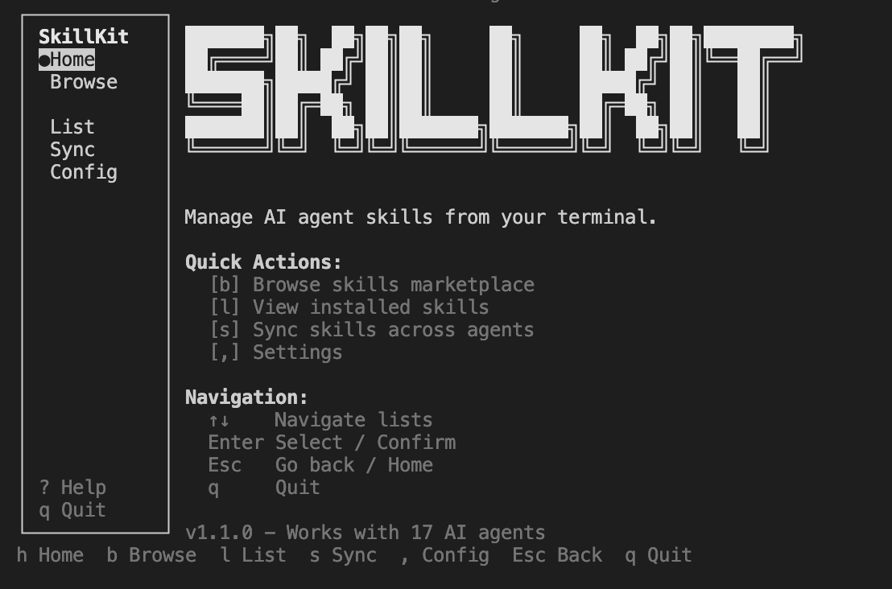

# SkillKit

[](https://www.npmjs.com/package/skillkit)
[](https://www.npmjs.com/package/skillkit)
[](https://github.com/rohitg00/skillkit/actions/workflows/ci.yml)
[](https://opensource.org/licenses/Apache-2.0)

**The universal skills platform for AI coding agents.** Install, manage, translate, and sync skills across 17+ AI tools with smart recommendations.

```bash
npm install -g skillkit && skillkit
```

## Why SkillKit?

| Problem | SkillKit Solution |
|---------|------------------|
| Skills only work with one agent | **Cross-agent translation** - use any skill with any agent |
| Don't know which skills to install | **Smart recommendations** - project-aware suggestions |
| Config fragmented across agents | **One config, all agents** - sync everywhere |
| Manual skill discovery | **Task-based search** - find skills by what you need |

## 30-Second Quick Start

```bash
# Install globally
npm install -g skillkit

# Get personalized skill recommendations for your project
skillkit recommend

# Install top-rated skills
skillkit install anthropics/skills

# Launch interactive TUI
skillkit
```

## Key Features

### Smart Recommendations
Analyzes your project and suggests the best skills:

```bash
skillkit recommend
# Project: my-app (Next.js + TypeScript + Tailwind)
#
# Recommended Skills:
#   92% ██████████ vercel-react-best-practices
#   87% █████████░ tailwind-v4-patterns
#   85% █████████░ nextjs-app-router
```

### Cross-Agent Translation
Use any skill with any agent - automatic format conversion:

```bash
# Translate a Claude skill to Cursor format
skillkit translate react-patterns --to cursor

# Translate all skills for a new agent
skillkit translate --all --to antigravity
```

### Project Context Sync
Configure once, sync to all your agents:

```bash
# Analyze project and create context
skillkit context init

# Sync your config to all detected agents
skillkit context sync --all
```

## Interactive TUI

Launch the beautiful terminal interface:

```bash
skillkit ui
# or simply
skillkit
```



**Features:**
- Browse 33+ skill repositories
- Smart skill recommendations based on your project
- Install skills with one keystroke
- Multi-agent installation support
- Cross-agent skill translation
- Responsive design for all terminal sizes

**Navigation:**
- `h` Home | `b` Browse | `r` Recommend | `l` List | `s` Sync | `,` Config
- `↑↓` Navigate | `Enter` Select | `Esc` Back | `q` Quit
- `m` Multi-agent selection | `/` Search

### Compatible With

| Agent | Status |
|-------|--------|
| Claude Code | ✅ Native |
| OpenAI Codex | ✅ Native |
| Cursor | ✅ Native |
| Gemini CLI | ✅ Native |
| OpenCode | ✅ Native |
| Antigravity | ✅ Native |
| Amp | ✅ Native |
| Clawdbot | ✅ Native |
| Droid (Factory) | ✅ Native |
| GitHub Copilot | ✅ Native |
| Goose | ✅ Native |
| Kilo Code | ✅ Native |
| Kiro CLI | ✅ Native |
| Roo Code | ✅ Native |
| Trae | ✅ Native |
| Windsurf | ✅ Native |
| *Any markdown-config agent* | ✅ Universal |

## Features

- **Smart Recommendations**: AI-powered skill suggestions based on your project stack
- **Cross-Agent Translation**: Convert skills between any of 17+ agent formats
- **Project Context Sync**: One config that syncs to all your agents
- **Session Memory**: Cross-agent learning system that captures and shares knowledge
- **Skill Marketplace**: Browse and install skills from curated GitHub repositories
- **Skill Testing**: Test framework for validating skills with assertions
- **Workflow Orchestration**: Compose skills into multi-step workflows
- **Interactive TUI**: Beautiful terminal interface for managing skills
- **Multi-Agent Support**: Works with Claude Code, Cursor, Codex, Windsurf, and 13+ more
- **Multi-Platform Git**: GitHub, GitLab, Bitbucket, and local paths
- **CI/CD Integration**: GitHub Actions, GitLab CI, CircleCI templates
- **Zero Config**: Auto-detects your agent and configures appropriately

## Installation

```bash
# Global install (recommended)
npm install -g skillkit

# Or use without installing
npx skillkit <command>

# Or with other package managers
pnpm add -g skillkit
yarn global add skillkit
bun add -g skillkit
```

## Quick Start

```bash
# 1. Get recommendations for your project
skillkit recommend

# 2. Install recommended skills
skillkit install anthropics/skills

# 3. Sync to your agent
skillkit sync

# Or just launch the TUI and do it all interactively
skillkit
```

## Popular Skill Repositories

Install skills from these community repositories:

```bash
# Anthropic's official skill marketplace
skillkit install anthropics/skills

# Vercel's React & Next.js best practices
skillkit install vercel-labs/agent-skills/skills
```


| Repository | Skills | Description |
|------------|--------|-------------|
| [anthropics/skills](https://github.com/anthropics/skills) | `pdf`, `xlsx`, `docx`, etc. | Official Claude Code skill marketplace |
| [vercel-labs/agent-skills](https://github.com/vercel-labs/agent-skills) | `vercel-react-best-practices`, `web-design-guidelines` | React/Next.js optimization & UI review |


## Commands

### `skillkit ui` / `skillkit`

Launch the interactive Terminal User Interface (TUI) for managing skills.

```bash
skillkit ui          # Explicit TUI launch
skillkit             # Launch TUI if no arguments provided
```

**TUI Features:**
- **Browse**: Discover skills from 33+ repositories
- **Recommend**: Get smart skill suggestions for your project
- **List**: View all installed skills
- **Sync**: Sync skills across multiple agents
- **Settings**: Configure SkillKit preferences

**Keyboard Shortcuts:**
- `h` - Home screen
- `b` - Browse skills marketplace
- `r` - Smart recommendations
- `l` - List installed skills
- `s` - Sync skills across agents
- `,` - Settings
- `↑↓` - Navigate lists
- `Enter` - Select / Install
- `m` - Multi-agent selection (when viewing skills)
- `/` - Search skills
- `Esc` - Return to home
- `q` - Quit

### `skillkit install <source>`

Install skills from various sources.

```bash
# GitHub (default)
skillkit install owner/repo
skillkit install https://github.com/owner/repo

# Install from a subdirectory
skillkit install owner/repo/skills

# GitLab
skillkit install gitlab:owner/repo
skillkit install https://gitlab.com/owner/repo

# Bitbucket
skillkit install bitbucket:owner/repo

# Local path
skillkit install ./my-skills
skillkit install ~/dev/skills

# Options
--list               # List available skills without installing
--skills=pdf,xlsx    # Install specific skills only (CI/CD)
--all                # Install all discovered skills
--yes                # Skip confirmation prompts
--global             # Install to global directory
--force              # Overwrite existing skills
--provider=gitlab    # Force specific provider
--agent=cursor       # Install to specific agent (can specify multiple)
```

### `skillkit sync`

Sync installed skills to your agent's config file.

```bash
skillkit sync
skillkit sync --agent cursor
skillkit sync --output AGENTS.md
skillkit sync --enabled-only
```

### `skillkit recommend`

Get smart skill recommendations based on your project's tech stack.

```bash
skillkit recommend                    # Analyze current directory
skillkit recommend --path ./my-app    # Analyze specific project
skillkit recommend --verbose          # Show detailed match reasons
skillkit recommend --limit 5          # Limit results
skillkit recommend --min-score 50     # Only show high matches
skillkit recommend --category security # Filter by category
skillkit recommend --search "auth"    # Search skills by task
skillkit recommend --update           # Update skill index
skillkit recommend --json             # Output as JSON
```

### `skillkit translate`

Translate skills between different agent formats.

```bash
skillkit translate react-skill --to cursor      # Translate to Cursor format
skillkit translate ./skill --from claude --to windsurf  # Explicit source/target
skillkit translate --all --to cursor            # Translate all installed skills
skillkit translate react-skill --to cursor --dry-run    # Preview without writing
```

**Supported translations:** All 17 agents can translate to/from each other.

### `skillkit context`

Manage project context for cross-agent synchronization.

```bash
skillkit context init                 # Analyze project and create context
skillkit context show                 # Display current context
skillkit context export               # Export context to file
skillkit context import ./context.yaml # Import context from file
skillkit context sync --agent cursor  # Sync context to specific agent
skillkit context sync --all           # Sync to all detected agents
```

### `skillkit read <skills>`

Read skill content for AI agent consumption.

```bash
skillkit read pdf
skillkit read pdf,xlsx,docx    # Multiple skills
```

### `skillkit list`

List all installed skills.

```bash
skillkit list
skillkit list --enabled
skillkit list --json
```

### `skillkit enable/disable <skills>`

Toggle skills on/off without removing them.

```bash
skillkit enable pdf xlsx
skillkit disable docx
```

### `skillkit update [skills]`

Update skills from their original sources.

```bash
skillkit update          # Update all
skillkit update pdf xlsx # Update specific
```

### `skillkit remove <skills>`

Remove installed skills.

```bash
skillkit remove pdf xlsx
```

### `skillkit init`

Initialize skillkit in a project.

```bash
skillkit init
skillkit init --agent cursor
skillkit init --list    # List supported agents
```

### `skillkit validate <path>`

Validate skills against the [Agent Skills specification](https://agentskills.io/specification).

```bash
skillkit validate ./my-skill        # Validate single skill
skillkit validate ./skills --all    # Validate all skills in directory
```

### `skillkit marketplace`

Browse and install skills from the curated marketplace.

```bash
skillkit marketplace                    # Browse all skills
skillkit marketplace search typescript  # Search for skills
skillkit marketplace refresh            # Refresh skill index
skillkit marketplace tags               # Show popular tags
skillkit marketplace sources            # List skill sources
skillkit marketplace --limit 20         # Limit results
skillkit marketplace --tags react,next  # Filter by tags
```

### `skillkit memory`

Manage session memory - learnings captured across AI coding sessions.

```bash
skillkit memory status              # Show memory status
skillkit memory search "auth"       # Search memories
skillkit memory list                # List all learnings
skillkit memory show <id>           # Show specific learning
skillkit memory compress            # Compress observations into learnings
skillkit memory export <id>         # Export learning as a skill
skillkit memory import ./file.yaml  # Import memories
skillkit memory add --title "..."   # Add manual learning
skillkit memory rate <id> 85        # Rate effectiveness (0-100)
skillkit memory --global            # Use global memory scope
```

### `skillkit test`

Test skills with the built-in testing framework.

```bash
skillkit test                       # Run all skill tests
skillkit test ./my-skill            # Test specific skill
skillkit test --tags unit           # Run tests with specific tags
skillkit test --json                # Output results as JSON
skillkit test --verbose             # Verbose output
```

### `skillkit workflow`

Manage and run skill workflows (multi-step skill compositions).

```bash
skillkit workflow list              # List available workflows
skillkit workflow run <name>        # Run a workflow
skillkit workflow create <name>     # Create new workflow
skillkit workflow validate <name>   # Validate workflow definition
skillkit workflow --verbose         # Verbose output
```

### `skillkit cicd`

Generate CI/CD integration templates.

```bash
skillkit cicd github-action         # Generate GitHub Actions workflow
skillkit cicd pre-commit            # Generate pre-commit hook
skillkit cicd gitlab-ci             # Generate GitLab CI config
skillkit cicd circleci              # Generate CircleCI config
skillkit cicd --list                # List available templates
skillkit cicd --output ./path       # Output to specific path
```

### `skillkit create <skill-name>`

Create a new skill with proper structure and template.

```bash
skillkit create my-skill                    # Basic skill
skillkit create my-skill --full             # Include all directories (references, scripts, assets)
skillkit create my-skill --scripts          # Include scripts directory
skillkit create my-skill --references       # Include references directory
skillkit create my-skill --assets           # Include assets directory
skillkit create my-skill --dir ./skills     # Create in specific directory
```

## Supported Agents

| Agent | Config File | Project Path | Global Path |
|-------|-------------|--------------|-------------|
| Claude Code | `AGENTS.md` | `.claude/skills/` | `~/.claude/skills/` |
| Cursor | `.cursorrules` | `.cursor/skills/` | `~/.cursor/skills/` |
| Codex | `AGENTS.md` | `.codex/skills/` | `~/.codex/skills/` |
| Gemini CLI | `GEMINI.md` | `.gemini/skills/` | `~/.gemini/skills/` |
| OpenCode | `AGENTS.md` | `.opencode/skills/` | `~/.config/opencode/skills/` |
| Antigravity | `AGENTS.md` | `.antigravity/skills/` | `~/.gemini/antigravity/skills/` |
| Amp | `AGENTS.md` | `.agents/skills/` | `~/.config/agents/skills/` |
| Clawdbot | `AGENTS.md` | `skills/` | `~/.clawdbot/skills/` |
| Droid (Factory) | `AGENTS.md` | `.factory/skills/` | `~/.factory/skills/` |
| GitHub Copilot | `AGENTS.md` | `.github/skills/` | `~/.copilot/skills/` |
| Goose | `AGENTS.md` | `.goose/skills/` | `~/.config/goose/skills/` |
| Kilo Code | `AGENTS.md` | `.kilocode/skills/` | `~/.kilocode/skills/` |
| Kiro CLI | `AGENTS.md` | `.kiro/skills/` | `~/.kiro/skills/` |
| Roo Code | `AGENTS.md` | `.roo/skills/` | `~/.roo/skills/` |
| Trae | `AGENTS.md` | `.trae/skills/` | `~/.trae/skills/` |
| Windsurf | `AGENTS.md` | `.windsurf/skills/` | `~/.codeium/windsurf/skills/` |
| Universal | `AGENTS.md` | `.agent/skills/` | `~/.agent/skills/` |

## Creating Skills

Use `skillkit create <name>` to scaffold a new skill, or create manually:

A skill is a directory with a `SKILL.md` file:

```
my-skill/
├── SKILL.md           # Required: Instructions for the AI
├── references/        # Optional: Documentation
├── scripts/           # Optional: Helper scripts
└── assets/            # Optional: Templates, configs
```

### SKILL.md Format

Follows the [Agent Skills specification](https://agentskills.io/specification):

```markdown
---
name: my-skill
description: What this skill does and when to use it. Include trigger keywords.
license: MIT
compatibility: Requires Node.js 18+
metadata:
  author: your-org
  version: "1.0"
---

# My Skill

Instructions for the AI agent on how to use this skill.

## When to Use

- Scenario 1
- Scenario 2

## Steps

1. First step
2. Second step
```

| Field | Required | Description |
|-------|----------|-------------|
| `name` | Yes | Lowercase alphanumeric with hyphens (max 64 chars) |
| `description` | Yes | What it does and when to use it (max 1024 chars) |
| `license` | No | License name or reference |
| `compatibility` | No | Environment requirements |
| `metadata` | No | Arbitrary key-value pairs |

## CI/CD Usage

```yaml
# GitHub Actions example
- name: Setup skills
  run: |
    npx skillkit install owner/skills --skills=lint,test,deploy --yes
    npx skillkit sync --yes
```

## Programmatic API

```typescript
import {
  // Skill discovery
  findAllSkills,
  discoverSkills,
  detectAgent,
  getAdapter,
  // Recommendations
  RecommendationEngine,
  analyzeProject,
  // Translation
  translateSkill,
  translateSkillFile,
  // Context
  ContextManager,
  initContext,
  syncToAllAgents,
  // Marketplace
  createMarketplaceAggregator,
  // Session Memory
  createMemoryCompressor,
  createMemoryInjector,
  LearningStore,
  ObservationStore,
  // Testing
  SkillTestRunner,
  // Workflows
  WorkflowOrchestrator,
  parseWorkflow,
  // CI/CD
  getCICDTemplate,
  listCICDTemplates,
} from 'skillkit';

// Find all installed skills
const skills = findAllSkills(searchDirs);

// Detect current agent
const agent = await detectAgent();

// Generate config
const adapter = getAdapter(agent);
const config = adapter.generateConfig(skills);

// Get smart recommendations
const engine = new RecommendationEngine();
const profile = await analyzeProject('./my-project');
const recommendations = engine.recommend(profile, skills);

// Translate skills between agents
const result = translateSkill(skillContent, 'cursor');
console.log(result.content); // Cursor MDC format

// Manage project context
const ctx = new ContextManager('./my-project');
await ctx.init();
await syncToAllAgents(ctx.getContext());

// Browse marketplace
const marketplace = createMarketplaceAggregator();
const results = await marketplace.search({ query: 'react' });

// Session memory
const injector = createMemoryInjector('./my-project');
const memories = injector.search('authentication patterns');

// Run skill tests
const runner = new SkillTestRunner('./my-project');
const testResults = await runner.runAll();

// Run workflows
const workflow = parseWorkflow('./workflow.yaml');
const orchestrator = new WorkflowOrchestrator(workflow);
await orchestrator.execute();
```

## Configuration

Create `skillkit.yaml` in your project:

```yaml
version: 1
agent: cursor           # Override auto-detection
autoSync: true          # Auto-sync on changes
enabledSkills:
  - pdf
  - xlsx
disabledSkills:
  - deprecated-skill
```

## License

Apache License 2.0 - see [LICENSE](LICENSE) for details.

## Contributing

Contributions welcome! Please read our [Contributing Guidelines](CONTRIBUTING.md) before submitting a pull request.

## Acknowledgments

Implements the [Agent Skills](https://agentskills.io) open format, originally developed by Anthropic and adopted by leading AI development tools.
